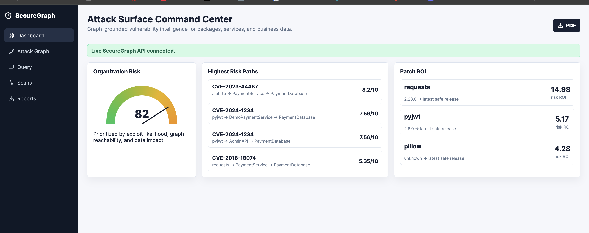
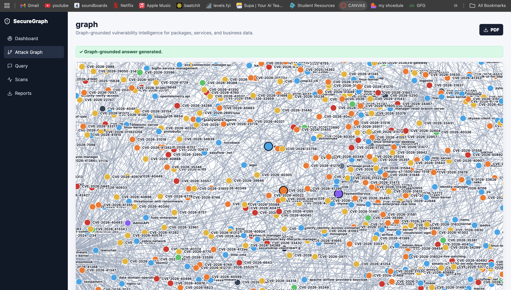
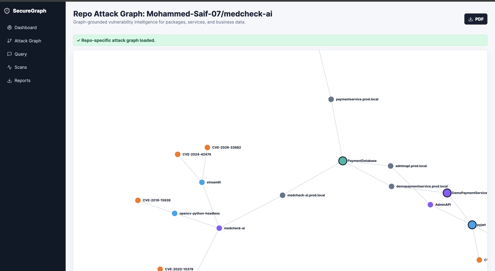
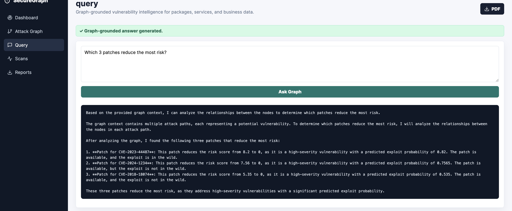
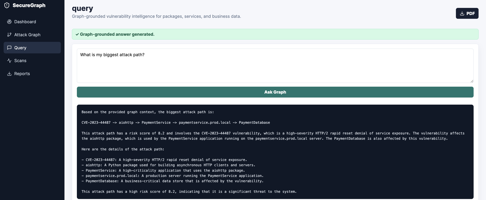
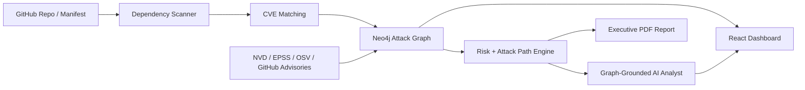

# SecureGraph

SecureGraph is a proprietary vulnerability intelligence platform that turns dependency findings into graph-grounded attack paths and patch ROI.

Instead of saying "you have 847 CVEs," SecureGraph answers: "these vulnerabilities can reach your payment database, and these patches remove the most risk."

## Why It Exists

Security teams do not need another long list of CVEs. They need to know which vulnerabilities matter to their infrastructure, which ones can reach sensitive systems, and which fixes reduce the most risk.

SecureGraph connects:

- Vulnerabilities
- Packages
- Services
- Runtime infrastructure
- Business-critical data
- Exploit likelihood
- Remediation priority

## Product Preview

### Attack Surface Command Center

### Global Attack Graph

### Repo-Specific Attack Graph

### Graph-Grounded Patch ROI

### Biggest Attack Path

## High-Level Architecture

## Core Capabilities

- Repository dependency scanning
- CVE-to-package matching
- Attack path graph generation
- Exploit likelihood and risk scoring
- Patch ROI ranking
- Graph-grounded natural language Q&A
- Repo-specific attack graph visualization
- Executive report generation
- Private-by-design deployment

## What Makes SecureGraph Different

| Category | Traditional scanners | SecureGraph |
| --- | --- | --- |
| Output | CVE lists | Business attack paths |
| Prioritization | Severity-first | Exploitability + reachability + data impact |
| AI | Generic explanation | Graph-grounded answers |
| Remediation | Patch available | Patch ROI and blast-radius reduction |
| Visualization | Findings table | CVE -> package -> service -> data graph |

## Positioning

SecureGraph complements developer security tools by adding graph-based business context.

Snyk and similar tools identify vulnerable dependencies. SecureGraph explains which vulnerable dependencies can reach critical business data and which patches remove the most risk.

## Technology

| Layer | Stack |
| --- | --- |
| Backend | Python, FastAPI |
| Frontend | React, TypeScript, D3 |
| Knowledge Graph | Neo4j |
| Data Store | PostgreSQL |
| Cache / Queue | Redis |
| AI | Groq LLM with graph-grounded context |
| Vulnerability Data | NVD, EPSS, OSV, GitHub Advisories |
| Packaging | Docker Compose |

## Access

SecureGraph is proprietary software. The full source code, backend logic, AI prompts, graph schema implementation, data ingestion pipeline, and deployment configuration are private.

Private technical demo access is available by request for serious acquisition, investment, or partnership discussions.

## Contact

Built by Mohammed Saif, MS CS student at Seattle University.

Email: smohammed8@seattleu.edu

GitHub: [Mohammed-Saif-07](https://github.com/Mohammed-Saif-07)

## License

Copyright (c) 2026 Mohammed Saif. All rights reserved.

This repository is for public product preview only. No source code license is granted.
